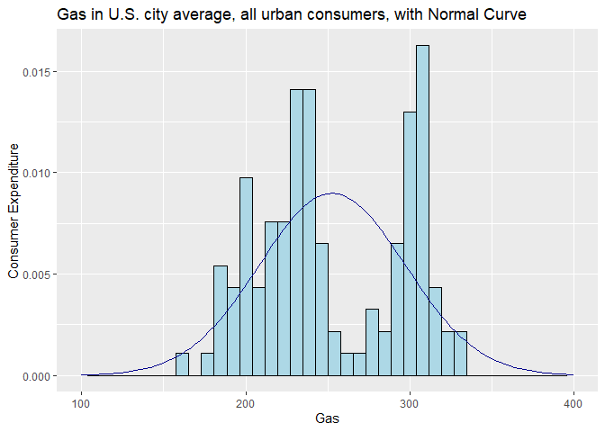

Assignment 1.2
================
Taniya Adhikari
03/22/2021

### 1\. Import, Plot, Summarize, and Save Data.

#### Importing the data

``` r
## Pull the data via the API
dta <- list('seriesid'=c('LNS14000000', 'CUSR0000SAF1', 
               'CUSR0000SETB01', 'CUSR0000SAM2', 'CUSR0000SA0'),'startyear'=2010,'endyear'=2020)

# fetching data from bls API
response <- blsAPI(dta, 2)
json <- fromJSON(response)

## Process results
apiDF <- function(data){
  df <- data.frame(year=character(),
                   period=character(),
                   periodName=character(),
                   value=character(),
                   stringsAsFactors=FALSE)
  
  i <- 0
  for(d in data){
    i <- i + 1
    df[i,] <- unlist(d)
  }
  return(df)
}

unemployment.df <- apiDF(json$Results$series[[1]]$data)
food.df <- apiDF(json$Results$series[[2]]$data)
gas.df <- apiDF(json$Results$series[[3]]$data)
medical_services.df <- apiDF(json$Results$series[[4]]$data)
all_items.df <- apiDF(json$Results$series[[5]]$data)

## Change value type from character to numeric
unemployment.df[,4] <- as.numeric(unemployment.df[,4])
food.df[,4] <- as.numeric(food.df[,4])
gas.df[,4] <- as.numeric(gas.df[,4])
medical_services.df[,4] <- as.numeric(medical_services.df[,4])
all_items.df[,4] <- as.numeric(all_items.df[,4])

## Rename value prior to merging
names(unemployment.df)[4] <- 'unemployement_rate'
names(food.df)[4] <- 'food'
names(gas.df)[4] <- 'gas'
names(medical_services.df)[4] <- 'medical_services'
names(all_items.df)[4] <- 'all_items'

## Merge data frames
df1 <- merge(unemployment.df, food.df)
df2 <- merge(df1, gas.df)
df3 <- merge(df2, medical_services.df)
df <- merge(df3, all_items.df)

df$date <- as.POSIXct(strptime(paste0('1',df$periodName,df$year), '%d%B%Y'))
```

#### Summarizing the data

|  | food          | gas           |
| :- | :------------ | :------------ |
|  | Min. :218.5   | Min. :162.7   |
|  | 1st Qu.:233.8 | 1st Qu.:218.9 |
|  | Median :246.0 | Median :240.8 |
|  | Mean :241.8   | Mean :252.8   |
|  | 3rd Qu.:250.0 | 3rd Qu.:299.9 |
|  | Max. :260.4   | Max. :332.7   |

Summary Statistics Table

|              |   food |     gas |
| ------------ | -----: | ------: |
| median       | 246.04 |  240.79 |
| mean         | 241.81 |  252.79 |
| SE.mean      |   1.06 |    4.06 |
| CI.mean.0.95 |   2.10 |    8.04 |
| var          | 135.49 | 1977.99 |
| std.dev      |  11.64 |   44.47 |
| coef.var     |   0.05 |    0.18 |
| skewness     | \-0.47 |    0.08 |
| skew.2SE     | \-1.08 |    0.19 |
| kurtosis     | \-0.80 |  \-1.33 |
| kurt.2SE     | \-0.92 |  \-1.51 |
| normtest.W   |   0.94 |    0.93 |
| normtest.p   |   0.00 |    0.00 |

Descriptive Statistics Table

#### Plotting the data

    ## Warning: Removed 2 rows containing missing values (geom_bar).

<!-- -->

    ## Warning: Removed 2 rows containing missing values (geom_bar).

<!-- --><!-- -->

#### Saving the data

### 2\. Explore Some Bivariate Relations.

#### Bivariate Relations

Scatter Plot

<!-- --><!-- -->

Correlation Matrix and Correlation Plot

|                     | unemployement\_rate |   food |    gas | medical\_services | all\_items |
| ------------------- | ------------------: | -----: | -----: | ----------------: | ---------: |
| unemployement\_rate |                1.00 | \-0.98 |   0.59 |            \-0.98 |     \-0.96 |
| food                |              \-0.98 |   1.00 | \-0.49 |              0.97 |       0.97 |
| gas                 |                0.59 | \-0.49 |   1.00 |            \-0.54 |     \-0.41 |
| medical\_services   |              \-0.98 |   0.97 | \-0.54 |              1.00 |       0.99 |
| all\_items          |              \-0.96 |   0.97 | \-0.41 |              0.99 |       1.00 |

Correlation Coefficient of variables

<!-- -->

### 3\. Organize Data Report.

#### Summary Reports

|  | year             | period           | periodName       | unemployement\_rate | food          | gas           | medical\_services | all\_items    | date                        |
| :- | :--------------- | :--------------- | :--------------- | :------------------ | :------------ | :------------ | :---------------- | :------------ | :-------------------------- |
|  | Length:120       | Length:120       | Length:120       | Min. :3.500         | Min. :218.5   | Min. :162.7   | Min. :405.0       | Min. :217.2   | Min. :2010-01-01 00:00:00   |
|  | Class :character | Class :character | Class :character | 1st Qu.:4.375       | 1st Qu.:233.8 | 1st Qu.:218.9 | 1st Qu.:442.2     | 1st Qu.:229.1 | 1st Qu.:2012-06-23 12:00:00 |
|  | Mode :character  | Mode :character  | Mode :character  | Median :5.650       | Median :246.0 | Median :240.8 | Median :469.6     | Median :237.1 | Median :2014-12-16 12:00:00 |
|  | NA               | NA               | NA               | Mean :6.221         | Mean :241.8   | Mean :252.8   | Mean :472.6       | Mean :237.1   | Mean :2014-12-16 03:20:00   |
|  | NA               | NA               | NA               | 3rd Qu.:8.200       | 3rd Qu.:250.0 | 3rd Qu.:299.9 | 3rd Qu.:506.2     | 3rd Qu.:244.3 | 3rd Qu.:2017-06-08 12:00:00 |
|  | NA               | NA               | NA               | Max. :9.900         | Max. :260.4   | Max. :332.7   | Max. :550.3       | Max. :258.2   | Max. :2019-12-01 00:00:00   |

Summary of the Variables

    ## 'data.frame':    120 obs. of  9 variables:
    ##  $ year              : chr  "2010" "2010" "2010" "2010" ...
    ##  $ period            : chr  "M01" "M02" "M03" "M04" ...
    ##  $ periodName        : chr  "January" "February" "March" "April" ...
    ##  $ unemployement_rate: num  9.8 9.8 9.9 9.9 9.6 9.4 9.4 9.5 9.5 9.4 ...
    ##  $ food              : num  218 219 219 219 219 ...
    ##  $ gas               : num  242 236 233 233 228 ...
    ##  $ medical_services  : num  405 407 408 409 410 ...
    ##  $ all_items         : num  217 217 217 217 217 ...
    ##  $ date              : POSIXct, format: "2010-01-01" "2010-02-01" ...

|              | unemployement\_rate |   food |     gas | medical\_services | all\_items |
| ------------ | ------------------: | -----: | ------: | ----------------: | ---------: |
| median       |                5.65 | 246.04 |  240.79 |            469.61 |     237.12 |
| mean         |                6.22 | 241.81 |  252.79 |            472.59 |     237.11 |
| SE.mean      |                0.19 |   1.06 |    4.06 |              3.62 |       1.01 |
| CI.mean.0.95 |                0.37 |   2.10 |    8.04 |              7.16 |       2.00 |
| var          |                4.25 | 135.49 | 1977.99 |           1570.48 |     122.64 |
| std.dev      |                2.06 |  11.64 |   44.47 |             39.63 |      11.07 |
| coef.var     |                0.33 |   0.05 |    0.18 |              0.08 |       0.05 |
| skewness     |                0.33 | \-0.47 |    0.08 |              0.04 |       0.04 |
| skew.2SE     |                0.74 | \-1.08 |    0.19 |              0.08 |       0.08 |
| kurtosis     |              \-1.37 | \-0.80 |  \-1.33 |            \-1.13 |     \-0.78 |
| kurt.2SE     |              \-1.56 | \-0.92 |  \-1.51 |            \-1.29 |     \-0.89 |
| normtest.W   |                0.90 |   0.94 |    0.93 |              0.96 |       0.97 |
| normtest.p   |                0.00 |   0.00 |    0.00 |              0.00 |       0.01 |

Descriptive Statistics Table

In this dataset we have 120 observations and following variables:

1.  *year*: This is a categorical variable. Does not have significance
    because it is redundant variable. I already have date variable.  
2.  *period*: This is a categorical variable.Does not have significance
    because it is just month variable.  
3.  *periodName*: This is a categorical variable. Does not have
    significance because it is just month variable.  
4.  *unemployement\_rate*: This is a continuous numerical variable.
5.  *food*: This is a continuous numerical variable.
6.  *gas*: This is a continuous numerical variable.
7.  *medical\_services*: This is a continuous numerical variable.
    8.*all\_items*: This is a continuous numerical variable. 9.*date*:
    This is date in datetime format.

Data is monthly average over the period of 2010-2020.

#### Key Insights

1.  The median monthly unemployment rate over the period of 10 years
    (2010-2020) is 5.65%.  
2.  The mean and median of all\_items consumption is same indicating
    that data maybe normally distributed. However, p-value of
    Shapiro-Wilk Test is less than 0.05 indicating data is not normally
    distributed.
3.  None of the variables are normally distributed because all the
    p-values are below 0.05  
4.  The range of average food consumption in all American cities falls
    between 218.5 to 260.4 over the period od 2010-2020.
